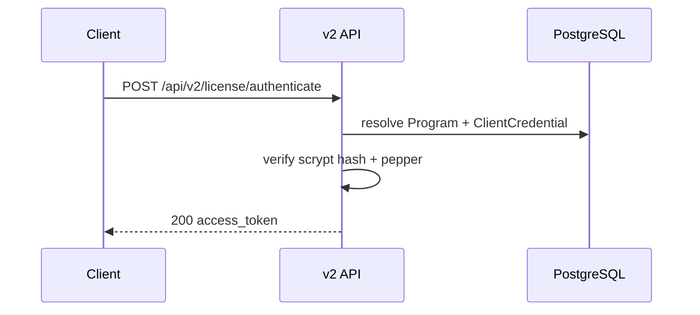
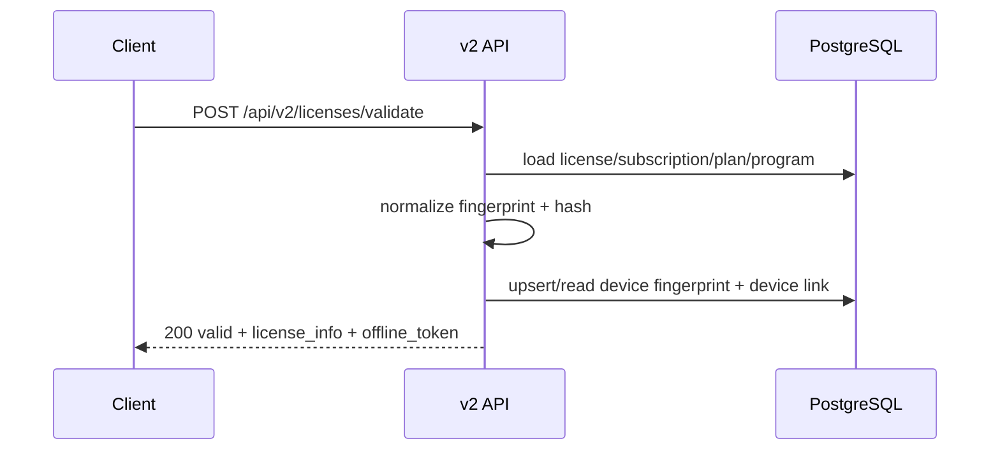
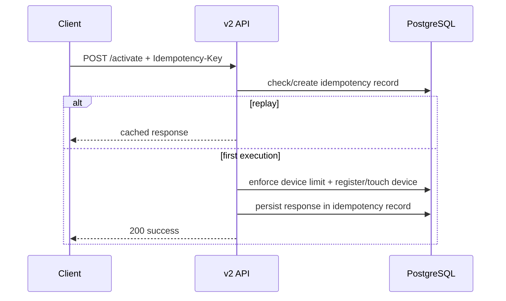

# Arquitetura - Fluxo de Dados

## 1) Authenticate

## 2) Validate

## 3) Activate (idempotente)

## 4) Transfer e Deactivate
- `transfer` desativa dispositivos ativos anteriores e ativa o novo fingerprint.
- `deactivate` desativa o dispositivo correspondente ao fingerprint informado.

## 5) Erros e correlacao
- Falhas mapeadas para `problem+json`.
- `trace_id` e `x-request-id` sao usados em logs, resposta e metricas.

## 6) Observabilidade
- Traces: OpenTelemetry (startup antes do bootstrap da app).
- Metricas: contadores/histograma HTTP + falhas de runtime + replay de idempotencia.
